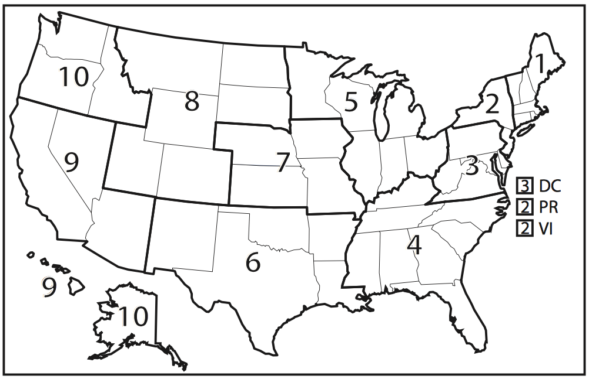
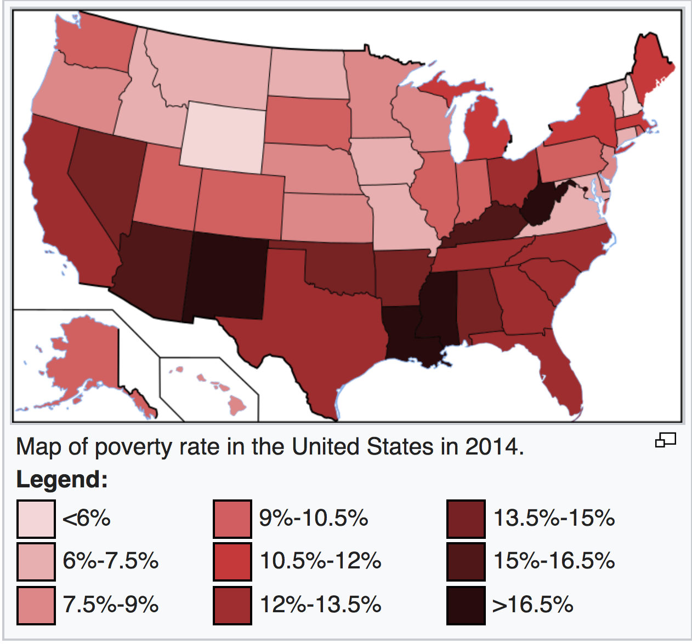

```{r set-up and loading packages, include=FALSE}
knitr::opts_chunk$set(
  collapse = TRUE,
  fig.width = 8,
  fig.asp = .6,
  out.width = "90%"
)

library(tidyverse)
library(rvest)
library(httr)
library(janitor)
library(stringr)
library(readxl)
library(plotly)
library(dplyr)
library(viridisLite)
library(forecast)
library(flexdashboard)
library(fiftystater)
library(RColorBrewer)
library(broom)
library(knitr)
library(forcats)
theme_set(theme_bw())
theme_update(legend.position = "bottom")

```

## Introduction and Motivation
The five leading causes of death in the United States from 1999 to 2014 are cancer, heart disease, unintentional injury, chronic lower respiratory disease, and stroke. The dataset includes the U.S. Department of Health and Human Services public health regions. Therefore, we can investigate the leading causes of death of each region, and suggest accordingly public health policy and remedies. 


## Data Descriptions
The dataset we are using has 191748 observations of 11 variables. The variables include `year`, `cause of death`, `state`, `age range`, `hhs region`, `locality`, `number of observed deaths`, `population`, `number of expected deaths`, `percent excess deaths`, and `number of potential excess deaths`. The hhs region indicates the 10 U.S. Departtment of Health and Human Servoces public health regions.

The number of observed deaths, population, number of expected deaths, percent of excess deaths, and number of excess deaths are continuous variables, and others are categorical variables. In this report, we are going to focus on percent excess deaths for locality, and how the five leading causes is distributed to the percent excess death. 
`Percent excess deaths` for each State are calculated as following: 

percent excess deaths = $\frac{\text{observed death} - \text{expected death}} {\text{observed death}}$

The percent excess deaths ranges from 0 to 85.3% with a mean of 35.66%. The locality is divided by metropolitan and nonmetropolitan areas. 

* Version of data used for analysis is [Here](https://data.cdc.gov/api/views/vdpk-qzpr/rows.csv?accessType=DOWNLOAD).\


## Approaches
* From the dataset, we obtain the information that the number of potentially excess deaths from the five leading causes in rural areas was higher than those in urban areas. 

* We then analyzed several factors that might influence the rural-urban difference in potentially excess deaths from the five leading causes, many of which are associated with sociodemographic and ecological differences between rural and urban areas. 

* Through statistical analysis, our report provides an interactive and straightforward view on the potentially excess deaths from the five leading causes of death in non-metropolitan and metropolitan areas. 

* The ultimate goal is to bring attention to preventing deaths in the rural areas through improving healthcare services and public health programs.


## Analysis and Visualizations

### Loading Data 

```{r load data,  message=FALSE}
cod_data = read_csv("./data/NCHS_-_Potentially_Excess_Deaths_from_the_Five_Leading_Causes_of_Death.csv") %>%
  clean_names() %>%
  na.omit() %>%
  filter(!(state == "United States")) %>%
  separate(., percent_potentially_excess_deaths, into = c("percent_excess_death"), sep = "%") %>% 
  mutate(percent_excess_death = as.numeric(percent_excess_death), mortality = observed_deaths/population * 10000, mortality = as.numeric(mortality)) %>% 
  select(year, age_range, cause_of_death, state, locality, observed_deaths, population, expected_deaths, potentially_excess_deaths, percent_excess_death, mortality, hhs_region)

##columns removed

 #"state_fips_code"                      "benchmark"   "potentially_excess_deaths" "percent_excess_death"      "mortality"   

```

```{r region data,  message=FALSE}
region_cod_data = cod_data %>%
  select(state, locality, hhs_region, percent_excess_death) %>% 
  group_by(state,locality, hhs_region) %>% 
  summarise(mean_ped = mean(percent_excess_death)) %>% 
  dplyr::filter(!(state == "District of\nColumbia")) %>% 
  mutate(hhs_region = as.character(hhs_region))

```


###Data Processing

After reviewing the dataset, we filter out entries with `United States` in `state` variable.  Then we remove the percentage mark in the `Percent Potentially Excess Deaths` variable. We also create a variable called `mortality`by calculating the quotient of `observed death` over `population`. Lastly we filter out entries with `District of Columbia` in `region` variable. After selecting the variables of interest, the data is ready for analysis.
When we analyze the relationships between the outcomes(`mortality`, `percent excess death`, etc) and several covariates(`year`, `cause of death`, `population`, etc), we group the data by the covariates and calculate the mean outcome as response. 


### Locality vs. Mortality

#### An Overview of the Data


This interactive plot examines the differences of Standardized Mortality Ratio (SMR), the proportion between observed death and expected death, of the five causes of death in each public health region. Each observation indicates for which state it belongs to with the size of which is reflective of the corresponding population. Here we compare SMR within the same geographic area. The differences of the distribution of the SMR among five causes of deaths might associate with the sociodemographic, cultural, behavioral and structural factors of the specific region. 


```{r xs2329,  message=FALSE}
cod_data %>%
  mutate(year = as.factor(year))
p <- cod_data %>%
  plot_ly(
    x = ~expected_deaths, 
    y = ~observed_deaths, 
    size = ~population, 
    color = ~cause_of_death, 
    frame = ~hhs_region, 
    text = ~state, 
    hoverinfo = "text",
    type = 'scatter',
    mode = 'markers'
  ) %>% 
  layout(title = "Change of Standardized Mortality Ratio in National Public Health Regions", yaxis=list(title="Observed Death"),xaxis=list(title="Expected Death"))

p
```


Here we show the division of the 10 U.S. Department of Health and Human Services public health regions in the figure below.\


\

\newline

#### Descriptive Analysis

#### Mortality for five leading causes of death by locality

From the linear regression plot below, we can see that the mortality of cancer, unintentional injury in both metropolitan regions and nonmetropolitan regions decrease through years 2005-2015. In contrast,  the mortality of heart disease and chronic lower respiratory disease in both metropolitan regions and nonmetropolitan regions increase through years 2005-2015. For stroke, the mortality in metropolitan regions decreases through years 2005-2015 whereas the mortality in metropolitan regions slightly increases through years 2005-2015. Concerning mortality and the trend in mortality, unintentional injury and heart disease needs more attention from public health experts.

```{r cl3664 mortality}
#mortality~year+cause
cod_datayr2 = read_csv("./data/NCHS_-_Potentially_Excess_Deaths_from_the_Five_Leading_Causes_of_Death.csv") %>%
  clean_names() %>%
  na.omit() %>%
  filter(!(state == "United States")) %>%
  separate(., percent_potentially_excess_deaths, into = c("percent_excess_death"), sep = "%") %>%
  mutate(percent_excess_death = as.numeric(percent_excess_death), mortality = observed_deaths/population * 10000, mortality = as.numeric(mortality)) %>%
  select(year, cause_of_death, state, benchmark, locality, observed_deaths, population, expected_deaths, potentially_excess_deaths, percent_excess_death, mortality)

lineplotyr = cod_datayr2 %>%
  filter(benchmark == "2010 Fixed",
         locality == c("Metropolitan", "Nonmetropolitan"))%>%
  group_by(cause_of_death,year, locality)%>%
  distinct(year, cause_of_death, locality, .keep_all = TRUE)%>%
  ungroup(year, cause_of_death)%>%
  ggplot(aes(x = year, y = mortality, group = locality, color = locality))+
  geom_point(size = 0.5)+
  geom_smooth(method = lm, size = 0.5,se=FALSE) +
  facet_grid(.~cause_of_death)+
  theme(axis.text.x = element_text(angle = 45, hjust = 1))+
  labs(x = "") +
  scale_x_continuous( breaks=seq(2005,2015,1))
  ggplotly(lineplotyr) %>% 
  layout(
     #xaxis = list(showticklabels = FALSE),
     legend = list(orientation = "h",
                   y = -0.1, x = 0.3))
```


```{r xs2329 boxplot,  message=FALSE}
cod_data %>%
  mutate(cause_of_death = fct_reorder(cause_of_death, mortality)) %>% 
  group_by(cause_of_death) %>% 
  ggplot(aes(x = cause_of_death, y = mortality, color = cause_of_death)) +
  geom_boxplot() +
  theme(axis.text.x = element_text(angle = 45, hjust = 1)) +
  labs(title="Locality vs. Mortality") +
  labs(x="Locality", y="Mortality", color = "Cause of Death") +
  facet_grid(~locality)

```

This bar graph shows the distribution of cause of death within `mortality` in the three geographic regions: `Metropolitan`, `Nonmetropolitan` and `All`. We observe that the rank in causes of death is the same regardless of the locality. Nonmetropolitan area seems to have the highest mortaility, the number of deathes observed in every 10000 people. We observe that the median of mortaility of Cancer is the highest among all 5 causes of death, followed by heart disease, unintentional injury, chronic lower respiratory disease and stroke. All 5 causes of death are right skewed regardless of the locality. 


#### Linear Model

To further support our graphs above, linear regression is performed between `mortality` and `locality`. The result shows that metropolitan regions have on average less mortality compared with nonmetropolitan regions.

```{r xs2329 lm,  message=FALSE}
mortality_lm = lm(mortality ~locality, data = cod_data)
summary(mortality_lm)
rl3 = broom::tidy(mortality_lm)
kable(rl3)
```


### Mean Percent Excess Death vs. Locality

#### Data Visualization

**Does mean percent excess death have significant difference between metro and non-metro groups?**

```{r wp2241,  message=FALSE}
gp_cod_data = cod_data %>%
  group_by(year, locality) %>% 
  summarise(mean_ped = mean(percent_excess_death)) 

gp_cod_data_Metro = gp_cod_data %>%
  group_by(year) %>%
  filter(locality == "Metropolitan")
gp_cod_data_nonMetro = gp_cod_data %>%
  group_by(year) %>%
  filter(locality == "Nonmetropolitan")
gp_cod = cbind(gp_cod_data_Metro, gp_cod_data_nonMetro)

p = gp_cod %>%
plot_ly( x = ~year, y = ~mean_ped, name = 'Metropolitan', type = 'scatter', mode = 'markers') %>%
  add_trace( y = ~mean_ped1, name = 'Nonmetropolitan', mode = 'markers') %>% 
  layout(yaxis = list(title = 'mean percent excess death (Metropolitan/Nonmetropolitan)'))
p

```

The above plot shows the gap of mean percent excess death for metropolitan and nonmetropolitan. Nonmetropolitan has a obviously larger mean percent excess death than metropolitan areas. In order to see if the difference is significant, we will run a regression analysis regarding mean excess death and locality.  


#### Regression Analysis

The regression model is mean percent_excess_death = 33.89 - 2.05*Metropolitan + 8.046Nonmetropolitan.\
* For people in metropolitan, the expected percent excess death has a decrease of 2.06. 
* For people in non-metropolitan area, the expected percent excess death has an increase of 8.046. 
* The p-values show these predictors are both significant. Therefore, we conclude that there is significant difference in mean percent excess death between Metropolitan and Nonmetropolitan Area.

```{r wp2241 reg,  message=FALSE}
gp_locality_lm = lm(mean_ped ~locality , data = gp_cod_data)
summary(gp_locality_lm)
rl4 = broom::tidy(gp_locality_lm)
kable(rl4)
```


### Mean Percentage of Excess Death vs. Five Leading Cause of Death

#### Account for Year

**How should we help nonmetropolitan areas improve public health? **

```{r cl3664 data,  message=FALSE}
cod_datayr2 = read_csv("./data/NCHS_-_Potentially_Excess_Deaths_from_the_Five_Leading_Causes_of_Death.csv") %>%
  clean_names() %>%
  na.omit() %>%
  filter(!(state == "United States")) %>%
  separate(., percent_potentially_excess_deaths, into = c("percent_excess_death"), sep = "%") %>%
  mutate(percent_excess_death = as.numeric(percent_excess_death), mortality = observed_deaths/population * 10000, mortality = as.numeric(mortality)) %>%
  select(year, cause_of_death, state, benchmark, locality, observed_deaths, population, expected_deaths, potentially_excess_deaths, percent_excess_death, mortality)
```

As can be seen in the following plot, if we stratify by `cause of death`, we will find some increasing pattern of `mean percentage of excess death` in subgroups(unintentional injury) and some decreasing patterns in other subgroups(cancer, heart disease, etc). In nonmetropolitan regions(right), `unintentional injury` and `chronic lower respiratory disease` have on average the highest excess death percentage in nonmetropolitan areas and need more attention from public health experts.

```{r cl3664 plot,  message=FALSE}
cod_datayr2 %>%
  filter(benchmark == "2010 Fixed") %>%
  group_by(cause_of_death,year, locality) %>%
  mutate(year_percent_death=mean(percent_excess_death)) %>%
  distinct(year, cause_of_death, locality, .keep_all = TRUE) %>%
  ungroup(year, locality) %>%
  ggplot(aes(x = year, y = year_percent_death, color = cause_of_death)) +
  geom_point(size = 1) +
  geom_line(size = 1) +
  facet_grid(.~locality) +
  theme(axis.text.x = element_text(angle = 45, hjust = 1)) +
  scale_x_continuous( breaks=seq(2005,2015,1)) +
  labs(
    title = "Average yearly excess death percentage for different locality",
    color = "Cause of Death",
    y = "Yearly Mean percentage of Excess Death"
    )
```

#####Linear Regression Analysis
From the linear model based on 2010 fixed benchmark, we can tell that controlling for `cause of death`, the `mean percentage of excess death` shows a decreasing pattern with time. Besides, in the same year, compared with cancer, other 4 causes have significantly higher excess death percentage. Herein `unintentional injury` and `chronic lower respiratory disease` have on average the highest excess death percentage.

```{r cl3664 lm,  message=FALSE}
cod_datayrlm = cod_datayr2 %>%
  filter(locality == "Nonmetropolitan",
         benchmark == "2010 Fixed")
lmpop = lm(data = cod_datayrlm, percent_excess_death ~ year+cause_of_death)
summary(lmpop)
rl5 = broom::tidy(lmpop)
kable(rl5)
```

####Account for Locality

**For each of the five cause of death, what is the mean percent of excess death? It is different across locality.**

As shown in the boxplots for all three regions, the rank of `mean percentage of excess death` of the five cause of death remain the same for different localities. For all five causes, the mean percent of death is lower for `Metropolitan` than `Nonmetropolitan`.

```{r yz3306.1,  message=FALSE}
cod_data %>%
  select(state, locality, percent_excess_death, hhs_region, cause_of_death) %>%
  filter(locality != "All") %>% 
  mutate(hhs_region = as.factor(hhs_region)) %>% 
  group_by(cause_of_death, locality) %>% 
  summarise(mean_ped = mean(percent_excess_death)) %>% 
  ungroup() %>% 
  ggplot(aes(x = cause_of_death,  y = mean_ped, fill = cause_of_death)) +
  geom_col() +
  facet_grid(~locality) +
  theme(axis.text.x = element_text(angle = 45, hjust = 1)) +
  labs(
    x = "Five Leading Causes of Death",
    y = "Mean Percentage of Excess Death",
    fill = "Causes of Death"
  )
```


####Account for HHS Regions

#####Linear Regression
We first fit `hhs_region` into the linear model, as well as a linear model with both `hhs_region` and `locality` to check their assosiations with mean percent excess deaths. 


```{r}
#Mean percent excess deaths ~ hhs_region
region_lm = lm(region_cod_data$mean_ped~region_cod_data$hhs_region)
rl1 = broom::tidy(region_lm)
kable(rl1)

#Mean percent excess deaths ~ hhs_region + locality
region_locality_lm = lm(region_cod_data$mean_ped ~ region_cod_data$hhs_region+region_cod_data$locality)
rl2 = broom::tidy(region_locality_lm)
kable(rl2)
```


As shown in the above summary tables, with respect to region 1, only region 2 has negative estimated coefficient, indicating less mean percentage of excess death . Specifically, comparing with region 1, region 2 has 1.67% less mean percentage of excess death on average. From region 3 to region 10, the mean percentage of excess death is higher compared with region 1. Similar results yield from regression adjusted for Locality. Adjusting `locality`, regions 4 and 6 have the top two highest increase in mean percentage of excess death with respect to region 1. Adjusting for different regions, similar result yield that, on average, metropolitan areas have 2% less than overall mean percentage of excess deaths and nonmetropolitan areas have 7% more than overall mean percentage of excess death. Thus we further checked the distribution of mean percent excess death varied by `hhs_region` across all five causes of death. 

#####Visualization

As mentioned above, we have significant difference in the `mean percentage of excess death` for different `HHS regions`. For all five causes of death, if we seperate the effect of the difference in cause of death into different `HHS region`, the following chart gives detailed information.\

As shown in the following graph, For all 5 causes of death, regions 3,4 and 6 have the top 3 mean percentage of excess death.\


```{r yz3306.3, message=FALSE}
cod_data %>%
  select(state, locality, percent_excess_death, hhs_region, cause_of_death) %>%
  filter(locality != "All") %>% 
  group_by(cause_of_death, locality, hhs_region) %>% 
  summarise(mean_ped = mean(percent_excess_death)) %>% 
  mutate(hhs_region = as.factor(hhs_region)) %>% 
  ggplot(aes(x = hhs_region,  y = mean_ped, fill = hhs_region)) +
  geom_col() +
  facet_grid(~cause_of_death) +
  theme(axis.text.x = element_text(angle = 15)) +
    labs(
      y = "Mean %Excess Death",
      x = "HHS Regions",
      fill = "HHS Region"
    ) 
    
  
```


In order to take the effect of `localtiy` into account, Flexdashboard with Shiny will be helpful. the link to the Shiny page is [Here - "Comparison of Difference in Mean %Excess Death of Five Leading Causes of Death between Metropolitan and Nonmetropolitan Area in each HHS regions"](https://fionalav.shinyapps.io/Final_prject_shiny/).\
Select different `HHS region` to visualized the difference between Metropolitan and Nonmetropolitan Area for all five causes of death, respectively.

As shown in the `Shiny-enabled Flexdashboard`, we observe that for all five causes of death, the Mean Percentage Excess Death is higher in Nonmetropolitan than Metropolitan Area for region 1, 3, 4, 6, 7 and 10, lower in Nonmetropolitan than Metropolitan Area for region 2, 5, 8, 9. In region 2, 5 and 9, only Stroke is higher in Metropolitan Area. For all other four causes of death, Nonmetropolitan is higher than Metropolitan Area.


##### U.S. Map with Mean Percent of Excess Death Rate Distribution


Here we have generated a map of the United States bases with color gradient showing the mean percentage of excess death rate regardless of the locality. [Here](https://fionalav.shinyapps.io/Final_prject_shiny/) is a Shiny link for a closer look of the national distribution of mean percentage excess death varied by locality -- metropolitan and nonmetropolitan areas -`U.S. Map with Mean Percent of Excess Death Rate Distribution`. We observe that for both metropolitan and nonmetropolitan areas, the Southeast region appears to have significantly high mean percent of excess death rate than the others, but the rural-urban gap is not apparent. This can be explained by the geographic features of the Southeast region. 


```{r,  message=FALSE}
map_cod_data = cod_data %>%
  filter(locality == "Metropolitan") %>%
  select(state, locality, percent_excess_death) %>% 
  group_by(state) %>% 
  summarise(mean_ped = mean(percent_excess_death)) %>% 
  dplyr::filter(!(state == "District of\nColumbia"))
  

map = as.tibble(fifty_states) %>%
  group_by(id) %>% 
  summarize(clong = mean(long), clat = mean(lat)) %>% 
  filter(!(id == "district of columbia"))

df <- cbind(map, state.abb, state.center, rate = unique(map_cod_data$mean_ped))

ggplot(df, aes(map_id = id)) + 
    geom_map(aes(fill = rate), map = fifty_states) + 
    expand_limits(x = fifty_states$long, y = fifty_states$lat) + 
    labs(x = "", y = "") +
    theme(panel.background = element_blank(), 
          axis.text.x = element_blank(), 
          axis.text.y = element_blank(), 
          axis.ticks = element_blank()) + 
    geom_text(aes(x = clong, y = clat, label = state.abb)) +
  scale_fill_gradient(low="gold", high="red")


```


If we compare this map with the poverty map of the US, we see that states with higher mean percent excess death is more likely to be in the poverty area. 

\


## Conclusion and Public Health Implications 


In this project, we analyzed the rural-urban gap of mortality rate and mean percent excess deaths in the United States from 2005-2015 with the goal of suggesting possible preventive methods and best practices to reduce such gap based on our findings. Major findings in this project include：


* Nonmetropolitan has significantly higher mean percent excess death than metropolitan areas in all ten years from 2005 to 2015.

* Nonmetropolitan has significantly higher mean percent excess death than metropolitan areas in all five causes of death.

* Southeast region appears to have significantly higher mean percent of excess death rate than the others for both metropolitan and nonmetropolitan areas, but the rural-urban gap is not apparent.

* The mean percent excess death from the five leading causes in rural areas this higher than that in urban areas in all 10 public health regions, although in each public health region, the distribution of mortality of each five causes of disease varies.


The above findings suggest that there might be sociodemographic, cultural, behavioral, and structural differences between rural-urban areas that contribute to the gap in mortality rate and mean percent excess deaths. People living in the rural area are more likely to experience poverty, poor nutrition, lack of physical activity, higher prevalence of tobacco use. More importantly, people from the rural areas are more vulnerable to potential disease due to the barriers to health care access. In rural areas as well as some less developed Southern states, health cares needs are often unmet due to lack of preventive and screening services and timely urgent and emergency services. 

From the findings of this project, we wish to emphasize the need and epidemiological burden of disease and raise the awareness of the rural-urban gap and address the nonuniform achievements of medical service in rural areas. Here we propose to prevent potential excess deaths by improving health care delivery system, introducing funded rural programs to cultivate health awareness and mediating health care workforce shortages. 


## Notes
* Link to the GitHub repository containing R Markdown document for this project is [Here](https://github.com/Fionalav/p8105_final_project).
* Link to the GitHub repository containing R Markdown document for Shiny Dashboard is [Here](https://github.com/Fionalav/final_project_shiny).


## References
* Garcia, M. C., Faul, M., Massetti, G., Thomas, C. C., Hong, Y., Bauer, U. E., & Iademarco, M. F. (2017). Reducing Potentially Excess Deaths from the Five Leading Causes of Death in the Rural United States. MMWR. Surveillance Summaries, 66(2), 1-7. doi:10.15585/mmwr.ss6602a1

\newline

* List of U.S. states by poverty rate. (2017, November 24). Retrieved December 06, 2017, from https://en.wikipedia.org/wiki/List_of_U.S._states_by_poverty_rate

